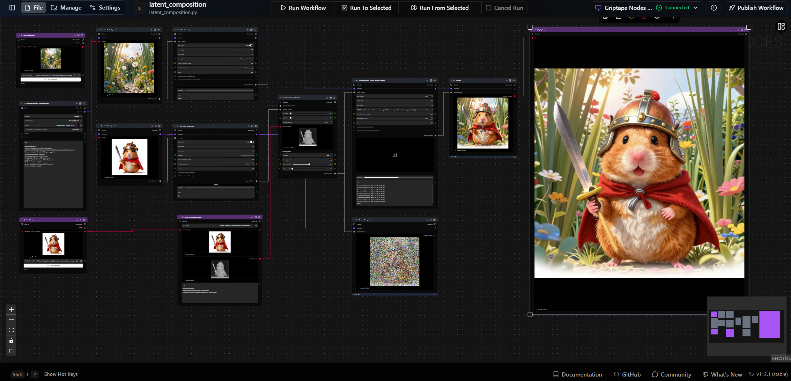
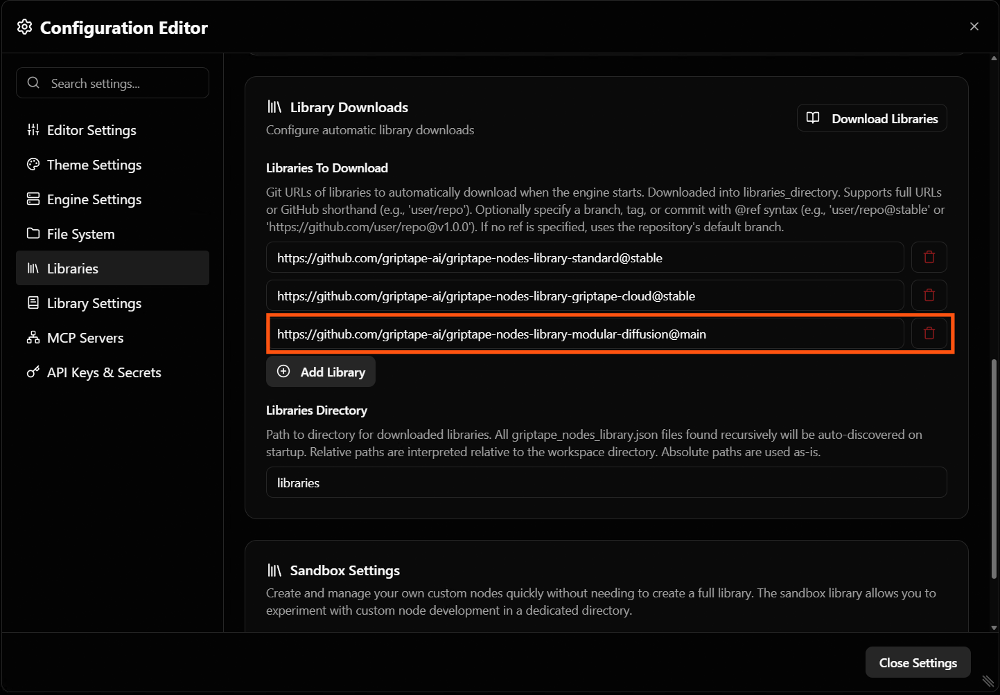

# Modular Diffusion Nodes Library
Build flexible media generation workflows with modular 🧨 Diffusers pipelines in [Griptape Nodes](https://github.com/griptape-ai/griptape-nodes).

The Modular Diffusion Nodes Library is a node library for creators who want more control over diffusion execution. Instead of running a fixed, monolithic "generate image" step, you break the diffusion process into individual, connectable stages — so you can inspect, reuse, and customize each part of the pipeline.

### [How it works](#how-it-works) | [Quick start](#quick-start) | [Supported models](#supported-models) | [Workflows](#workflow-templates-included) | [Docs](docs/index.md) | [Support](#support)

> ## ⚠️ Experimental — under active development
> APIs, node interfaces, workflow templates, and library structure may change at any time without notice or migration support. Pin to a specific commit if you need stability, and expect breakage when updating. 
>



## How it works

A typical flow looks like this:

1. **Build a pipeline once** with the Pipeline Builder, and reuse it across multiple generations.
1. **Create or load latents** (noise, empty, encoded image/video, or a saved tensor).
1. **Run diffusion** to produce new latents — optionally multiple times for multi-stage or rediffusion workflows.
1. **Transform latents** with math, masked compositing, or upsampling between stages.
1. **Decode** the final latents back into images or video with the VAE.

Because every stage is a node, you can branch, chain, and reorder steps — enabling patterns like multi-stage refinement, ControlNet stacking, latent composition, first/last-frame video conditioning, and latent upscaling that aren't possible with a single end-to-end generate node.

## Quick start

The easiest way to install this library is through the **Configuration Editor** in the Griptape Nodes UI:

1. Open **Settings → Libraries** to reach the **Library Downloads** panel.
1. Under **Libraries To Download**, click **Add Library** and paste the repository URL:
    ```text
    https://github.com/griptape-ai/griptape-nodes-library-modular-diffusion@main
    ```
    You can pin to a branch, tag, or commit using `@ref` syntax (e.g. `@stable`, `@v1.0.0`).
1. Click **Download Libraries** in the top right, then **Close Settings**.
1. Restart the engine. The **ModularDiffusion** node categories will appear in the node picker.



### Manual configuration

Alternatively, register the library directly in your `griptape_nodes_config.json`:

```json
{
  "app_events": {
    "on_app_initialization_complete": {
      "libraries_to_register": [
        "path/to/griptape-nodes-library-modular-diffusion/griptape_nodes_library.json"
      ]
    }
  }
}
```

## Supported models

Models are selected on the Pipeline Builder via a `provider` dropdown. Currently supported:

- **Flux** and **Flux2** (including Flux2-Klein)
- **Stable Diffusion XL**
- **Qwen-Image** (and Qwen-Edit)
- **Z-Image**
- **LTX** (video)
- **WAN** (text-to-video and image-to-video)

Models are loaded from Hugging Face repositories in Diffusers format (single-file `.safetensors` checkpoints are not loaded directly — use a Hugging Face repo ID). Multiple **LoRAs** can be attached to a pipeline via the builder.

> **Note:** All models are downloaded locally to the Hugging Face cache the first time they're used (default: `~/.cache/huggingface/hub` on Linux/macOS, `%USERPROFILE%\.cache\huggingface\hub` on Windows). To store them elsewhere, set the `HF_HOME` environment variable globally before launching the engine — e.g. `HF_HOME=D:\models\hf` on Windows or `export HF_HOME=/mnt/models/hf` on Linux/macOS.

## Controls

Prompts, guidance, and other generation knobs are exposed as parameters on the generation and conditioning nodes — they vary per model, since each pipeline supports different inputs. Shared runtime controls include `num_inference_steps`, `seed` and step-range controls for multi-stage workflows. ControlNet and LoRA nodes expose their own influence/weight parameters. See the [docs](docs/index.md) for per-node details.

## Live previews

Enable live image previews to stream intermediate decoded images during generation. Useful for monitoring long runs, at the cost of inference speed.

To turn it on:

1. Open **Settings → Library Settings** in the Griptape Nodes UI.
1. Scroll to the **Modular Diffusion Library** section.
1. Toggle **Enable Image Preview Intermediates** on.


## Performance and memory

The Pipeline Builder caches the loaded pipeline in memory and reuses it across runs, only rebuilding when the configuration changes.

For lower-VRAM setups, the builder exposes a **Memory Optimization Strategy** selector:

- **Automatic** — Griptape picks reasonable defaults for the chosen model.
- **Manual** — you control each knob individually:
    - **Quantization mode**: `fp8`, `int8`, or `int4` (via `optimum-quanto` / `bitsandbytes`) — shrinks transformer weights at the cost of some quality.
    - **CPU offload strategy**: `Model` (whole submodules) or `Sequential` (per-layer) — moves weights to CPU when idle to free VRAM, at the cost of inference speed.
    - **Attention slicing** — runs attention in smaller chunks; cheap memory win, small speed hit.
    - **VAE slicing** — decodes the latent in batches of 1; helps with large batch sizes.
    - **Transformer layerwise casting** — keeps the transformer in a lower precision and upcasts per layer during compute.

Enable only what you need — each option trades some speed for memory. The Pipeline Builder includes per-parameter help badges with more detail.

## Workflow templates included

- Text2Image
- MultistageText2Image
- LoRAText2Image
- ControlnetText2Image
- Image2Image
- FirstAndLastFrameImage2Video

## Requirements

This library is intended for GPU-capable environments (**CUDA** or **MPS**). See [griptape_nodes_library.json](griptape_nodes_library.json) for the full dependency list.

## Support

Found a bug or have a feature request? Please [open an issue](https://github.com/griptape-ai/griptape-nodes-library-modular-diffusion/issues).

## Contributing

See [CONTRIBUTING.md](CONTRIBUTING.md) for development setup and contribution guidelines.
