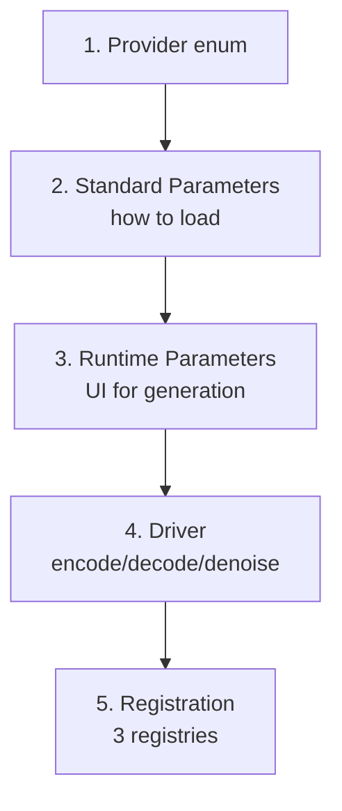

# Adding a New Model to the Modular Diffusion Library

This guide walks through adding support for a new diffusion model (e.g., Stable Diffusion 3.5, HunyuanVideo 1.5) to `diffusers_nodes_library/`.

---

## ⚠️ Read This First — Modular-Blocks-First Philosophy

**The long-term goal of this library is to use the [diffusers `ModularPipeline` block system](https://github.com/huggingface/diffusers/tree/main/src/diffusers/modular_pipelines) for ALL pipeline operations** — encode, decode, noise latent, add-noise, *and* the denoise loop. When adding a new model, **prefer modular blocks wherever they exist** for the diffusers pipeline you are integrating.

### Three blockers preventing full migration today

Three concerns currently force every driver to delegate the **denoise loop** to `DiffusionPipeline.__call__()` rather than to a modular block sequence. These are the open problems blocking the full migration:

1. **Partial denoise** — `PartialDenoisePipelineRunner` / `PartialDenoiseSchedulerProxy` in [`misc/partial_denoise.py`](../diffusers_nodes_library/misc/partial_denoise.py) intercept `pipe.scheduler.set_timesteps()` to slice the schedule for partial denoising. There is no equivalent injection point on a `ModularPipeline` denoise block.
2. **Callback / preview** — Step-end previews and progress are driven by `callback_on_step_end(pipe, i, _t, callback_kwargs)`, passed via `pipe_kwargs` to `DiffusionPipeline.__call__()` (see `LatentPipelineDriver.denoise_latent()` in [`latent_pipeline_drivers/base_driver.py`](../diffusers_nodes_library/latent_pipeline_drivers/base_driver.py)). Modular denoise blocks do not expose this hook.
3. **Cancellation** — Cancellation is implemented by setting `pipe._interrupt = True` inside the step callback (see `generate_latent_parameters.py`). `ModularPipeline` has no equivalent interrupt mechanism.

### What this means in practice

- **Encode / decode / create-noise / add-noise / encode-prompt** → use modular blocks via `self.modular_pipe.blocks.sub_blocks[...]` and `self._call_block(...)`. Every existing driver already does this; follow that precedent.
- **Denoise loop** → fall back to `DiffusionPipeline.__call__()` via the base class `denoise_latent()` (which handles partial-denoise, callback, cancellation, and inpaint routing for you). Only override `denoise_latent()` for model-specific kwarg munging — never to bypass the base class' callback/partial-denoise wiring.

When the three blockers above are resolved, drivers will be able to swap their denoise path to modular blocks without touching encode/decode logic. Designing your new driver around this split keeps it future-proof.

---

## Is this a new pipeline type or a runtime variant?

**Default to variant** — adding a runtime variant is cheaper and reuses already-loaded weights. Try the variant path first and only fall back to this guide when the test below fails.

**The test**: can `<NewPipelineClass>.from_pipe(base_pipe)` produce a *working* pipeline using the components already loaded on an existing base pipeline (UNet/transformer, VAE, text encoders, scheduler)?

- **Yes** → runtime variant. Stop and follow [`.github/skills/add-pipeline-variants/SKILL.md`](../.github/skills/add-pipeline-variants/SKILL.md). Examples: ControlNet, inpaint, LTX's `LTXConditionPipeline`.
- **No** — the variant class needs a component the base pipeline does not have, or needs differently-shaped/-trained weights for an existing component → new pipeline type. Continue with this guide. Examples: WAN T2V vs WAN I2V (different UNet + image encoder), Flux vs Flux Fill (different transformer weights), Qwen vs Qwen Edit (different transformer + image conditioning).

## The 5-Step Process

Adding a new model touches five concerns. We'll use **Stable Diffusion 3.5** as the running example.



### Step 1 — Add a Provider (if new)

[`parameters/providers.py`](../diffusers_nodes_library/parameters/providers.py) is a `StrEnum`. Add an entry if your model family doesn't already exist:

```python
class Provider(StrEnum):
    ...
    STABLE_DIFFUSION_3 = "Stable Diffusion 3"
```

Skip only if the new model is a sibling checkpoint of an existing **architecture generation** (same transformer family, same text encoders) — in that case add it to the existing Provider's `get_pipeline_type_dict()` instead. A new architecture generation always gets its own Provider.

### Step 2 — Standard Parameters (pipeline loading)

Create `standard_parameters/<model>_parameters.py`. Subclass `ModularDiffusionPipelineTypePipelineParameters` from [`parameters/modular_pipeline_type_parameters.py`](../diffusers_nodes_library/parameters/modular_pipeline_type_parameters.py). Model after [`standard_parameters/stable_diffusion_sdxl_parameters.py`](../diffusers_nodes_library/standard_parameters/stable_diffusion_sdxl_parameters.py) for simple cases, or [`flux_parameters.py`](../diffusers_nodes_library/standard_parameters/flux_parameters.py) when multiple sub-component repos (text encoders, VAE) are exposed separately.

Required overrides:
- `_pipeline_cls` — the diffusers pipeline class
- `pipeline_name` — **must exactly match the key** in [`driver_factory.py`](../diffusers_nodes_library/latent_pipeline_drivers/driver_factory.py) `_DRIVER_REGISTRY`
- `add_input_parameters()` / `remove_input_parameters()`
- `get_config_kwargs()` — returned to the builder node for hashing
- `get_build_data()` — picklable dict consumed by `build_pipeline_from_build_data()`
- `build_pipeline_from_build_data()` — classmethod that calls `from_pretrained(...)`
- `validate_before_node_run()` — pre-run validation errors

Optional overrides on the base class:
- `is_prequantized()` → True for bnb-4bit models
- `supports_layerwise_casting()` → False if the transformer checks weight dtype before forward
- `requires_device_map()` → True for pipelines like GLM-Image that need `accelerate` device_map

### Step 3 — Runtime Parameters (UI on the generate node)

Create `runtime_parameters/<model>_runtime_parameters.py`. Subclass `DiffusionPipelineRuntimeParameters` from [`runtime_parameters/runtime_parameters.py`](../diffusers_nodes_library/runtime_parameters/runtime_parameters.py). Model after [`flux_runtime_parameters.py`](../diffusers_nodes_library/runtime_parameters/flux_runtime_parameters.py).

Required overrides:
- `_add_input_parameters()` — register `Parameter` objects for prompt, negative_prompt, guidance_scale, true_cfg_scale, etc.
- `_remove_input_parameters()` — symmetric tear-down
- `_get_pipe_kwargs()` — collect parameter values into the dict passed to the pipeline

Do **not** add `num_inference_steps`, `generator`, or `seed` — the base class adds these.

### Step 4 — Driver (the core abstraction)

Create `latent_pipeline_drivers/<model>.py`. Subclass `LatentPipelineDriver` from [`base_driver.py`](../diffusers_nodes_library/latent_pipeline_drivers/base_driver.py).

**Read the `LatentPipelineDriver` docstring before writing a line.** It defines the binding contract for every public driver method:

> Public latents are **unpacked** (4-D image `[B, C, H/vae, W/vae]`, 5-D video `[B, C, T_lat, H/vae, W/vae]`) and **normalised** (~N(0,1)). Per-VAE whitening `(z - mean) / std` is applied inside `encode_image/encode_video`; the inverse runs inside `decode_latent`. Model-specific packing (Flux, Qwen) is applied transiently in `prepare_input_latent` / `prepare_output_latent` and never appears on the public surface.

Required overrides:

| Method | Implementation guidance |
|---|---|
| `_create_modular_pipe()` | Call the diffusers `*AutoBlocks().init_pipeline()` for your model. Modular-first. |
| `can_make_control_pipe_from_standard()` | Return False unless you implement ControlNet. |
| `create_noise_latent()` | Prefer the diffusers modular `PrepareLatents` block via `self._call_block(...)`. See [`stable_diffusion_xl.py`](../diffusers_nodes_library/latent_pipeline_drivers/stable_diffusion_xl.py) `_SDXLPrepareNoiseLatentStep`. |
| `encode_image()` | Use `self.modular_pipe.blocks.sub_blocks["vae_encoder"]` where available. Apply VAE whitening. |
| `decode_latent()` | Use `self.modular_pipe.blocks.sub_blocks["decode"]` where available. Apply inverse whitening. |
| `add_noise_to_latent()` | Prefer modular `Img2ImgSetTimesteps` + `Img2ImgPrepareLatents` block sequence. |

Optional overrides:
- `prepare_input_latent` / `prepare_output_latent` — pack/unpack for transformers that use sequence-packed latents (Flux, Qwen)
- `encode_video()` — for video models. Set `produces_video = True` and `video_fps`.
- `_extract_latents_from_output()` — return `pipe_output.frames` for video, default `images` for image
- `encode_prompt()` — only if your text encoder block needs extra inputs beyond `prompt`/`negative_prompt`
- `denoise_latent()` — **only for kwarg munging** (e.g., LTX building video conditions, WAN i2v extracting first/last frames). Always end by calling `super().denoise_latent(...)` so partial-denoise, callback, cancellation, and inpaint hooks keep working.
- `_inpaint_pipeline_class` ClassVar — set to the inpaint pipeline class to enable inpainting

### Step 5 — Register in three places

**a) [`latent_pipeline_drivers/driver_factory.py`](../diffusers_nodes_library/latent_pipeline_drivers/driver_factory.py)** — map pipeline class name → driver class:

```python
_DRIVER_REGISTRY: dict[str, type[LatentPipelineDriver]] = {
    ...
    "StableDiffusion3Pipeline": StableDiffusion3LatentPipelineDriver,
}
```

**b) [`parameters/pipeline_parameters.py`](../diffusers_nodes_library/parameters/pipeline_parameters.py)** — add a `case` in `set_runtime_parameters()`:

```python
case "StableDiffusion3Pipeline":
    self._runtime_parameters = StableDiffusion3PipelineRuntimeParameters(self._node)
```

**c) [`parameters/pipelinetype_parameters.py`](../diffusers_nodes_library/parameters/pipelinetype_parameters.py)** — create a `LatentPipelineTypeParameters` subclass and register it in `MODULAR_PIPELINE_TYPE_PROVIDER_MAP`:

```python
class LatentStableDiffusion3PipelineTypeParameters(LatentPipelineTypeParameters):
    @classmethod
    def get_pipeline_type_dict(cls):
        return {"StableDiffusion3Pipeline": StableDiffusion3PipelineParameters}

MODULAR_PIPELINE_TYPE_PROVIDER_MAP = {
    ...
    Provider.STABLE_DIFFUSION_3: LatentStableDiffusion3PipelineTypeParameters,
}
```

---

## Verification

1. Run `make check` to catch type/lint errors.
2. Open Griptape Nodes, drop a `LatentDiffusionPipelineBuilderNode`, select your new provider, then your new pipeline type, fill in the repo, and resolve the node.
3. Wire it to a `DiffusionPipelineGenerateLatentNode` and a VAE decoder; verify an image (or video) is produced.
4. Test partial denoise by chaining two generate nodes (e.g., 0–10 then 10–20 steps).
5. Test cancellation mid-run.

---

## When in doubt

- **Existing drivers are the source of truth.** Pick the closest match to your model and copy its structure.
- **Read the diffusers source** under `.venv/Lib/site-packages/diffusers` before assuming a modular block exists.
- **Don't bypass the base class `denoise_latent`** for callback/partial-denoise concerns — the three blockers above are open problems and must be solved at the framework level, not per-driver.
