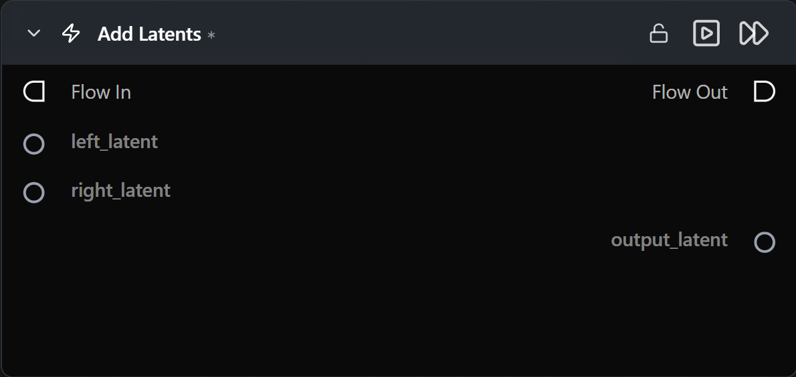

# Add Latents

**Elementwise sum of two latent tensors.**

Category: `ModularDiffusion/Transform`

## TL;DR
- `output = left_latent + right_latent` elementwise.
- Both inputs must share the same shape and latent space (i.e. come from the same pipeline type).
- Common uses: blending two denoised latents, injecting controlled noise, residual additions between stages.

## Typical workflow position
```text
Generate Media Latents (A) ─┐
                            ├─→ [Add Latents] → Generate / Decode
Generate Media Latents (B) ─┘
```

## Node preview



## Inputs

| Name | Type | Required | Notes |
| --- | --- | --- | --- |
| `left_latent` | `LatentArtifact` | Yes | |
| `right_latent` | `LatentArtifact` | Yes | Must match `left_latent` shape. |

## Outputs

| Name | Type | Notes |
| --- | --- | --- |
| `output_latent` | `LatentArtifact` | `left + right`. |

## Tips & pitfalls

- **Shape mismatch fails validation.** Resize or upsample one of the inputs first.
- **Mixing latents from different pipeline families is unsafe** — the latent spaces are not compatible.

## See also

- [Subtract Latents](subtract_latents.md) · [Multiply Latents](multiply_latents.md) · [Latents Composite Mask](latents_composite_mask.md)
