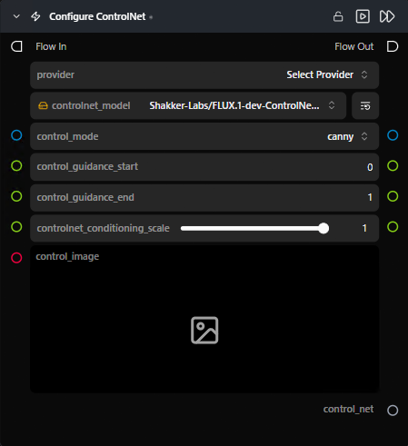

# Configure ControlNet

**Configures one ControlNet entry — model, control image, and conditioning strength — for use with the ControlNet Pipeline node.**

Category: `ModularDiffusion/Conditioning`

## TL;DR
- Pick `provider` first; the rest of the parameters are **dynamic** and regenerate per provider.
- One node = one ControlNet. To stack multiple, drop multiple nodes and connect each `control_net` output to the [ControlNet Pipeline](controlnet_pipeline.md) node's `control_nets` list input.
- Supported providers: **Flux, Qwen, Stable Diffusion, Z-Image** etc.

## Typical workflow position
```text
Load Image → [Configure ControlNet] → ControlNet Pipeline → Generate Media Latents
```

## Node preview



## Inputs

| Name | Type | Required | Notes |
| --- | --- | --- | --- |
| `control_image` | `ImageArtifact` / `ImageUrlArtifact` | Yes | The control signal (canny edges, depth map, pose, etc. — depends on the ControlNet model). |
| `controlnet_conditioning_scale` | float (0.0–1.0) | No | Influence of this ControlNet, default `1.0`. |
| `controlnet_model` | HF repo picker | Yes | The ControlNet model to use; choices update per provider. |

## Outputs

| Name | Type | Notes |
| --- | --- | --- |
| `control_net` | `control_net` (dict) | Entry to feed into the ControlNet Pipeline node. |

## Provider / model behavior

The model dropdown and extra parameters change per provider. Notable extras:

- **Flux** — `control_mode` (`canny`, `tile`, `depth`, `blur`, `pose`, `gray`, `low_quality`), `control_guidance_start`, `control_guidance_end`.
- **Qwen / Stable Diffusion / Z-Image** — provider-specific model repos and conditioning knobs.

## Tips & pitfalls

- **Provider must match the base pipeline.** A Flux ControlNet plugged into an SDXL pipeline will be rejected by the ControlNet Pipeline node's validator.
- **Preprocess control images upstream.** Run your detector (Canny, depth estimator, pose) in an earlier node and feed the result directly — this node expects a ready-to-use control image.
- **`controlnet_conditioning_scale` is per-ControlNet.** When stacking, each node has its own weight.

## See also

- [ControlNet Pipeline](controlnet_pipeline.md) — required downstream consumer.
- Workflow template: `workflows/templates/ControlnetText2Image.py`.
