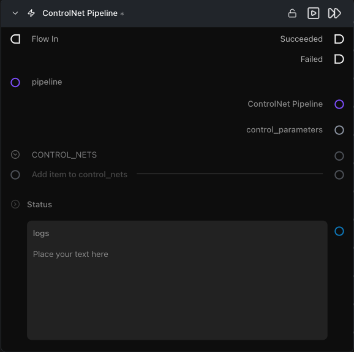

# ControlNet Pipeline

**Wraps a built pipeline so it accepts ControlNet inputs at generation time.**

Category: `ModularDiffusion/Pipeline`

## TL;DR
- Sits **between** the [Pipeline Builder](pipeline_builder.md) and [Generate Media Latents](generate_media_latents.md) — it re-wires the cached pipeline to a ControlNet variant.
- Accepts a list of `control_net` configs (from one or more [Configure ControlNet](configure_controlnet.md) nodes). Stacked ControlNets are supported where the model allows it (e.g. Flux Union).
- Output type: `Pipeline Config` — drop-in replacement for the base pipeline downstream.

## Typical workflow position
```text
Pipeline Builder → [ControlNet Pipeline] → Generate Media Latents → Decode Media Latent
Configure ControlNet ─┘
Configure ControlNet ─┘
```

## Node preview



## Inputs

| Name | Type | Required | Notes |
| --- | --- | --- | --- |
| `pipeline` | `Pipeline Config` | Yes | From a base [Pipeline Builder](pipeline_builder.md). Must **not** already be a ControlNet pipeline. |
| `control_nets` | `list[control_net]` | Yes | One or more entries from [Configure ControlNet](configure_controlnet.md). All must match the base pipeline's provider. |

## Outputs

| Name | Type | Notes |
| --- | --- | --- |
| `controlnet_pipeline` | `Pipeline Config` | Pipeline artifact with ControlNet wiring. |
| `control_parameters` | `control_parameters` | Pass-through of all connected ControlNet configs. Connect to the `controlnet_parameters` input on Generate Media Latents. |
| `logs` | `str` | Build log, including the resolved config hash. |

## Tips & pitfalls

- **Provider must match.** Each ControlNet's `provider` must equal the base pipeline's provider — the node validates this before running.
- **Pipeline class compatibility.** Not every base pipeline supports ControlNet stacking; the node validates the driver before running and surfaces which combination is unsupported.
- **Stack multiple ControlNets within a single node.** Use multiple `control_nets` entries on one ControlNet Pipeline node rather than chaining two ControlNet Pipeline nodes — the second node will error if the input is already a ControlNet artifact.
- **Pipeline reuse** ControlNet weights may be loaded for the selected control_nets; the base pipeline itself is reused from cache when available.

## See also

- [Configure ControlNet](configure_controlnet.md) — produces the `control_net` entries this node consumes.
- [Modular Diffusion Pipeline Builder](pipeline_builder.md) — required upstream.
- Workflow template: `workflows/templates/ControlnetText2Image.py`.
