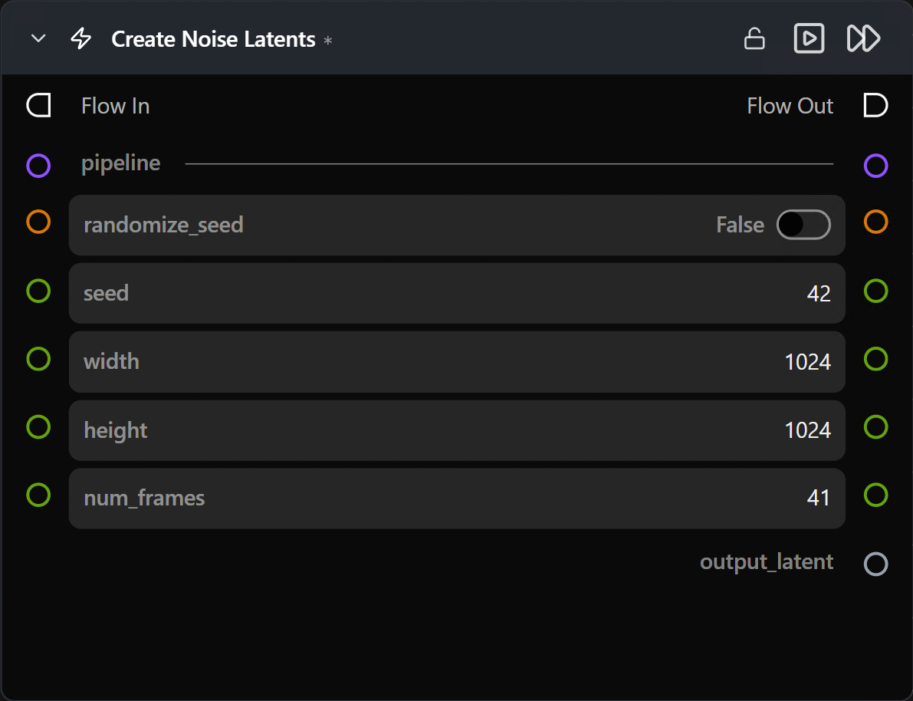

# Create Noise Latents

**Generates a random-noise latent tensor matching the connected pipeline's expected shape — the typical starting point for text-to-image / text-to-video flows.**

Category: `ModularDiffusion/Create`

## TL;DR
- Drop this between the **Pipeline Builder** and **Generate Media Latents** for any pure text-to-image / text-to-video flow.
- `width` / `height` are pixel-space; the node handles VAE down-scaling internally.
- `num_frames` appears only when the connected pipeline produces video (LTX, LTX2, WAN). It's hidden otherwise.
- `seed` controls reproducibility — same seed + same pipeline + same dimensions → identical latent.

## Typical workflow position
```text
Pipeline Builder → [Create Noise Latents] → Generate Media Latents → Decode Media Latent
```

## Node preview



## Inputs

| Name | Type | Required | Notes |
| --- | --- | --- | --- |
| `pipeline` | `Pipeline Config` | Yes | From the Pipeline Builder. Determines shape, VAE scale factor, and whether `num_frames` is shown. |

## Outputs

| Name | Type | Notes |
| --- | --- | --- |
| `output_latent` | `LatentArtifact` | Unpacked, normalized (~N(0,1)) noise tensor. Feed to Generate Media Latents. |

## Parameters

| Name | Type | Default | Notes |
| --- | --- | --- | --- |
| `width` | int (pixels) | `1024` | Pixel-space width. Internally divided by the VAE scale factor. |
| `height` | int (pixels) | `1024` | Pixel-space height. |
| `num_frames` | int | `41` | Number of video frames. **Hidden for image pipelines.** |
| `seed` | int | random | Reproducibility. |
| `num_inference_steps` | int | `20` | **Only shown for SDXL** — used by SDXL to scale the initial noise. Other pipelines ignore this. |

## Tips & pitfalls

- **`width` / `height` must respect VAE divisibility.** Most VAEs require multiples of 8 or 16. Pick standard dimensions (512, 768, 1024, …) to keep shapes valid.
- **Same seed across pipelines ≠ same image.** Latent shape and VAE space differ per model; the seed is only meaningful within one pipeline type.
- **For Image-to-Image or rediffusion, use [Encode Media Latent](encode_media_latent.md) instead.** Encoding an existing image gives you a conditioned starting point; optionally feed it through Generate Media Latents with `add_noise=True`.

## See also

- [Create Empty Latents](empty_latents.md) — zero-filled variant for masked compositing or specific multi-stage tricks.
- [Encode Media Latent](encode_media_latent.md) — for image / video → latent.
- [Generate Media Latents](generate_media_latents.md) — typical consumer.
