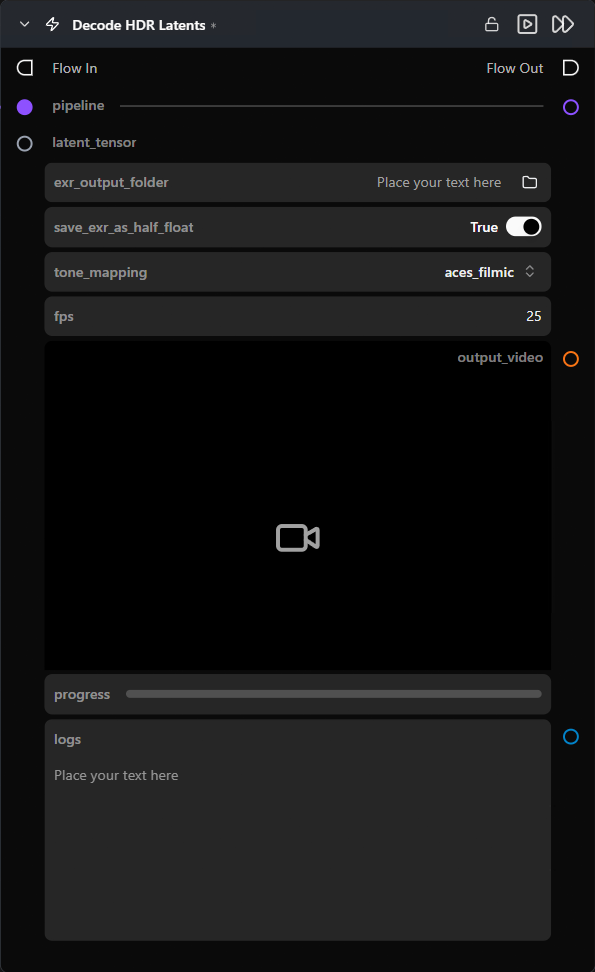

# Decode HDR Latents

**Decodes an HDR latent, applies tone mapping, and optionally exports the raw linear EXR frame sequence.**

Category: `ModularDiffusion/Encode\Decode`

## TL;DR
- Extends [Decode Media Latent](decode_media_latent.md): same inputs and dynamic image/video output, plus tone mapping and EXR export for HDR video pipelines (e.g. LTX 2.3 HDR).
- Output is always a tone-mapped SDR image or MP4 video — set `exr_output_folder` to also save the raw linear HDR frames as an OpenEXR sequence before tone mapping is applied.
- Standard (non-HDR) pipelines behave identically to Decode Media Latent; tone mapping is not applied.
- HDR output applies only to pipeline drivers that return linear `np.ndarray` frames (LTX 2.3 HDR); all other pipelines use the standard decode path.

## Typical workflow position
```text
Generate Media Latents → [Decode HDR Latents] → Save Image / Save Video
```

## Node preview



## Inputs

| Name | Type | Required | Notes |
| --- | --- | --- | --- |
| `pipeline` | `Pipeline Config` | Yes | Must match the pipeline that produced the latent. Use an HDR-capable driver (e.g. LTX 2.3 HDR) to get linear frame output. |
| `latent_tensor` | `LatentArtifact` | Yes | Latent to decode. |

## Outputs

| Name | Type | Notes |
| --- | --- | --- |
| `output_image` | `ImageArtifact` | Tone-mapped image. Shown for image pipelines. |
| `output_video` | `VideoUrlArtifact` | Tone-mapped MP4 video. Shown for video pipelines. |
| `logs` | str | Per-frame EXR write log. Populated only when `exr_output_folder` is set. |

## Parameters

| Name | Type | Default | Notes |
| --- | --- | --- | --- |
| `tone_mapping` | `clip \| reinhard \| aces_filmic \| cv2_reinhard \| cv2_mantiuk` | `aces_filmic` | Operator applied to linear HDR frames before encoding to SDR output. Ignored for non-HDR pipelines. |
| `fps` | int (1–120) | `25` | Output frame rate. Only shown for video pipelines. |
| `exr_output_folder` | path | — | Folder or `.exr` file path for saving the raw linear HDR EXR sequence. Leave empty to skip EXR export. |
| `save_exr_as_half_float` | bool | `True` | Store EXR frames as float16 — 2.5× smaller files with negligible quality loss. |

## Tips & pitfalls

- **`aces_filmic` preserves bright highlights better than `clip`.** Use `clip` only when chroma accuracy matters more than highlight rolloff, or when comparing SDR to HDR output numerically.
- **EXR filenames are derived from the path you supply — three patterns are supported:**
  - `output/frames/` (trailing slash, folder) → files saved as `output/frames/frame_0000.exr`, `frame_0001.exr`, …
  - `output/frames` (no trailing slash, no extension, existing or non-existing folder) → same as above, stem `frame`
  - `output/frames/shot.exr` (`.exr` extension) → files saved as `output/frames/shot_0000.exr`, `shot_0001.exr`, …
- **Use the same pipeline that produced the latent.** Decoding with a mismatched VAE produces corrupt output — the pipeline carries the VAE that matches.
- **VRAM spike on decode.** Large latents (high resolution, many frames) can spike memory. Enable `vae_slicing` on the Pipeline Builder if you hit out-of-memory errors.

## See also

- [Decode Media Latent](decode_media_latent.md) — base node; use for non-HDR pipelines.
- [Generate Media Latents](generate_media_latents.md) — typical upstream node.
