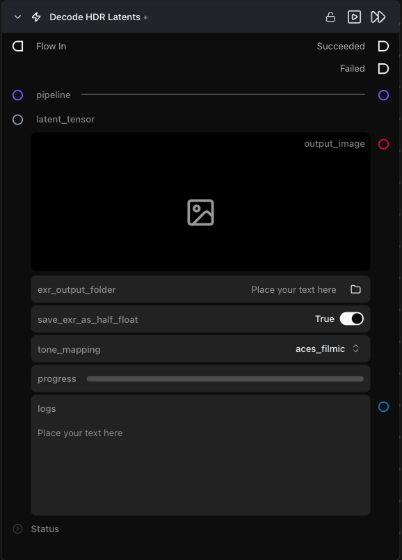

# Decode HDR Latents

**Decodes a latent to float RGB media, exposes the unmodified frames, and publishes a tone-mapped SDR preview.**

Category: `ModularDiffusion/Encode\Decode`

## TL;DR
- Extends [Decode Media Latent](decode_media_latent.md): same inputs and dynamic image/video preview, plus a `raw_media` float output for downstream processing or EXR export.
- Output includes the decoded float array and a tone-mapped SDR image or MP4 preview. Connect `raw_media` to [Save EXR Sequence](save_exr_sequence.md) to write OpenEXR frames.
- Decoded video output remains available as a tone-mapped preview, including audio when the selected driver produces it.
- The `raw_media` array remains in the decoder's native output color space; it is not tone-mapped or inverse-transformed.

## Typical workflow position
```text
Generate Media Latents → [Decode HDR Latents] ──→ SDR Preview
                              └────────────────→ [Save EXR Sequence]
```

## Node preview



## Inputs

| Name | Type | Required | Notes |
| --- | --- | --- | --- |
| `pipeline` | `Pipeline Config` | Yes | Must match the pipeline that produced the latent. Float output retains that model's decoder color space. |
| `latent_tensor` | `LatentArtifact` | Yes | Latent to decode. |

## Outputs

| Name | Type | Notes |
| --- | --- | --- |
| `raw_media` | `FloatMediaArtifact` | In-process decoded float RGB array, before tone mapping. Connect to Save EXR Sequence. |
| `output_image` | `ImageUrlArtifact` | Tone-mapped image preview. Shown for image pipelines. |
| `output_video` | `VideoUrlArtifact` | Tone-mapped MP4 preview. Shown for video pipelines. |

## Parameters

| Name | Type | Default | Notes |
| --- | --- | --- | --- |
| `tone_mapping` | `clip \| reinhard \| aces_filmic \| cv2_reinhard \| cv2_mantiuk` | `aces_filmic` | Operator applied to decoded float frames before publishing the SDR preview. |
| `fps` | int (1–120) | `25` | Output frame rate. Only shown for video pipelines. |

## Tips & pitfalls

- **Connect `raw_media` to Save EXR Sequence for file output.** The decoder itself no longer writes files, so export settings live in one dedicated node.
- **Treat `raw_media` as in-process data.** `FloatMediaArtifact` is intentionally not serialized with workflow state; run the decoder and saver in the same execution.
- **Choose the transfer conversion to match the producing model.** Enable inverse log-gamma in Save EXR Sequence for log-gamma output; disable it for already-linear HDR output such as LTX 2.3 HDR.
- **Use the same pipeline that produced the latent.** Each pipeline carries the VAE it was trained with — decoding with a mismatched VAE produces corrupt output.
- **Large latents need more VRAM to decode.** High-resolution or multi-frame latents require more memory during decode. Enable `vae_slicing` on the Pipeline Builder to decode in batches and keep peak VRAM usage lower.

## See also

- [Decode Media Latent](decode_media_latent.md) — base node; use for non-HDR pipelines.
- [Generate Media Latents](generate_media_latents.md) — typical upstream node.
- [Save EXR Sequence](save_exr_sequence.md) — writes decoded float frames as OpenEXR.
