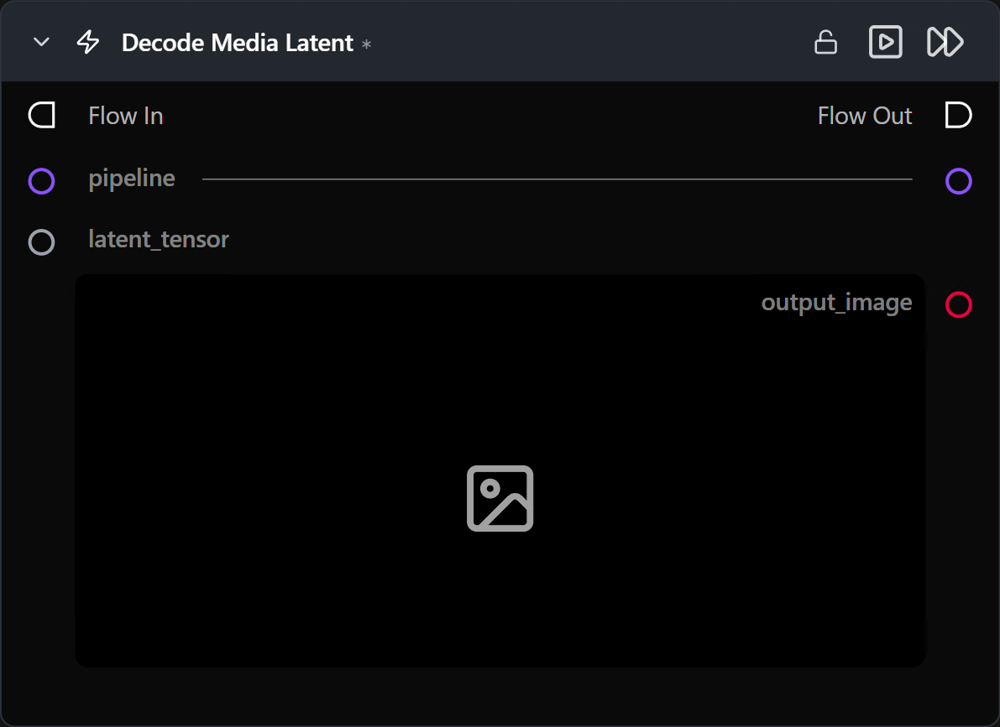

# Decode Media Latent

**Runs the pipeline's VAE decoder on a latent, producing an image or video — typically the final node in a flow.**

Category: `ModularDiffusion/Encode\Decode`

## TL;DR
- Output is **dynamic**: `output_image` for image pipelines, `output_video` (+ `fps`) for video pipelines (LTX, WAN). It swaps automatically when you connect a `pipeline`.
- Almost always the last node in the flow. Connect to a Save Image / Save Video node downstream.

## Typical workflow position
```text
Generate Media Latents → [Decode Media Latent] → Save Image / Save Video
```

## Node preview



## Inputs

| Name | Type | Required | Notes |
| --- | --- | --- | --- |
| `pipeline` | `Pipeline Config` | Yes | Must match the pipeline that produced the latent. |
| `latent_tensor` | `LatentArtifact` | Yes | Latent to decode. |

## Outputs

| Name | Type | Notes |
| --- | --- | --- |
| `output_image` | `ImageArtifact` | For image pipelines. |
| `output_video` | `VideoUrlArtifact` | For video pipelines. |

## Parameters

| Name | Type | Default | Notes |
| --- | --- | --- | --- |
| `fps` | int (1–120) | `25` | Output frame rate. **Only shown for video pipelines.** |

## Tips & pitfalls

- **Use the same pipeline that produced the latent.** Decoding a Flux latent with an SDXL VAE produces garbage. The pipeline carries the VAE that matches.
- **VRAM spike on decode.** Large latents (high resolution, many frames) can spike memory during decode. Enable `vae_slicing` on the Pipeline Builder if you hit OOM.
- **Output is non-serializable**: the parameter holds an in-memory artifact, not a saved file. Use a Save node downstream.

## See also

- [Encode Media Latent](encode_media_latent.md) — inverse operation.
- [Generate Media Latents](generate_media_latents.md) — typical upstream node.
