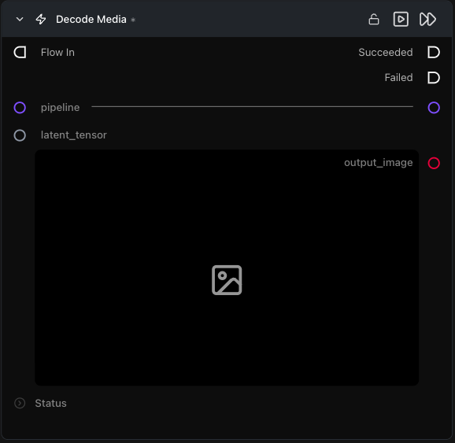

# Decode Media Latent

**Runs the pipeline's VAE decoder on a latent, producing an image or video — typically the final node in a flow.**

Category: `ModularDiffusion/Encode\Decode`

## TL;DR
- Output is **dynamic**: `output_image` for image pipelines, `output_video` (+ `fps`) for video pipelines (LTX, LTX2, WAN, HunyuanVideo 1.5, MiniMax-H3). It swaps automatically when you connect a `pipeline`.
- Almost always the last node in the flow. Connect to a Save Image / Save Video node downstream.
- **MiniMax-H3 videos come out with sound.** The soundtrack is generated jointly with the picture and muxed into the same MP4 here. Connect Generate Media Latents **directly** to this node.

## Typical workflow position
```text
Generate Media Latents → [Decode Media Latent] → Save Image / Save Video
```

## Node preview



## Inputs

| Name | Type | Required | Notes |
| --- | --- | --- | --- |
| `pipeline` | `Pipeline Config` | Yes | Must match the pipeline that produced the latent. |
| `latent_tensor` | `LatentArtifact` | Yes | Latent to decode. |

## Outputs

| Name | Type | Notes |
| --- | --- | --- |
| `output_image` | `ImageArtifact` | For image pipelines. |
| `output_video` | `VideoUrlArtifact` | For video pipelines. |

## Parameters

| Name | Type | Default | Notes |
| --- | --- | --- | --- |
| `fps` | int (1–120) | `25` | Output frame rate. **Only shown for video pipelines.** |

## Provider / model behavior

| Provider | Behavior |
| --- | --- |
| Image pipelines | `output_image` as an `ImageArtifact`. |
| LTX, LTX2, WAN, HunyuanVideo 1.5 | `output_video` as a silent MP4 at `fps`. |
| MiniMax-H3 | `output_video` as an MP4 **with an audio track**. Video and audio are generated jointly by one denoising loop, and are muxed together here. Leave `fps` at `24` — MiniMax-H3 generates at a fixed 24 fps, and any other value desynchronises the soundtrack. |

### MiniMax-H3: keep the edge direct

MiniMax-H3's audio latent travels in the latent's *metadata*, not in its tensor. Only a direct
`Generate Media Latents → Decode Media Latent` edge preserves it:

- **Empty Latents, Save/Load Latent Tensor** drop the audio metadata. Decoding still works and
  produces a silent video, with a warning in the logs.
- **Add / Subtract / Multiply Latents, Latents Composite Mask, Latent Upsampler** are worse: they
  change the video latent but carry the *old* audio latent through unchanged. This node detects that
  mismatch and **fails with an error** rather than muxing a soundtrack that no longer matches the
  picture.

## Tips & pitfalls

- **Use the same pipeline that produced the latent.** Each pipeline carries the VAE it was trained with — decoding a latent with a mismatched VAE produces corrupt output.
- **Large latents need more VRAM to decode.** High-resolution or multi-frame latents require more memory during decode. Enable `vae_slicing` on the Pipeline Builder to decode in batches and keep peak VRAM usage lower.

## See also

- [Encode Media Latent](encode_media_latent.md) — inverse operation.
- [Generate Media Latents](generate_media_latents.md) — typical upstream node.
