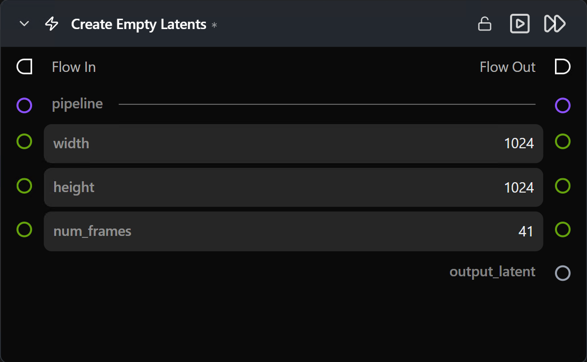

# Create Empty Latents

**Generates a zero-filled latent tensor of the shape expected by the connected pipeline.**

Category: `ModularDiffusion/Create`

## TL;DR
- Same shape behavior as [Create Noise Latents](create-noise-latents.md), but the tensor is all zeros (no random seed).
- Useful as the **destination** for [Latents Composite Mask](latents_composite_mask.md), or as a starting point when you want fully controlled noise injection downstream.
- For ordinary text-to-image / text-to-video generation you almost always want [Create Noise Latents](create-noise-latents.md) instead.

## Typical workflow position
```text
Pipeline Builder → [Create Empty Latents] → Latents Composite Mask → Generate Media Latents
```

## Node preview



## Inputs

| Name | Type | Required | Notes |
| --- | --- | --- | --- |
| `pipeline` | `Pipeline Config` | Yes | Determines latent shape and whether `num_frames` is shown. |

## Outputs

| Name | Type | Notes |
| --- | --- | --- |
| `output_latent` | `LatentArtifact` | Zero-filled latent tensor in the pipeline's canonical latent space. |

## Parameters

| Name | Type | Default | Notes |
| --- | --- | --- | --- |
| `width` | int (pixels) | `1024` | Pixel-space width. |
| `height` | int (pixels) | `1024` | Pixel-space height. |
| `num_frames` | int | `41` | Number of video frames. **Hidden for image pipelines.** |

No `seed` parameter — output is deterministic by construction.

## Tips & pitfalls

- **An all-zero latent only works if you add noise later.** Feeding it directly to [Generate Media Latents](generate_media_latents.md) with `add_noise=False` will not produce reasonable output, but it becomes a valid starting latent if that downstream node has `add_noise=True` (or if you inject noise with composite / math nodes first).

## See also

- [Create Noise Latents](create-noise-latents.md) — the usual text-to-image / text-to-video starting tensor.
- [Latents Composite Mask](latents_composite_mask.md) — primary consumer.
