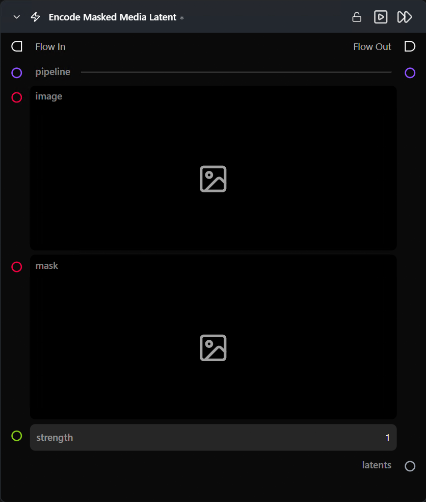

# Encode Masked Media Latent

**Encodes a source image plus a binary mask into an `InpaintMaskArtifact` — the input format that switches Generate Media Latents into inpainting mode.**

Category: `ModularDiffusion/Encode\Decode`

## TL;DR
- Use for **inpainting**. The resulting artifact carries the mask + masked-image latent + strength together so downstream nodes don't need separate inputs.
- Connect the `latents` output to a Generate Media Latents node's `input_latent`. The Generate node detects the artifact type and routes through the inpaint pipeline automatically.
- Only works with pipelines that have a registered inpaint pipeline class (e.g. Flux Fill, SDXL Inpaint).

## Typical workflow position
```text
Load Image ──┐
             ├─→ [Encode Masked Media Latent] → Generate Media Latents → Decode
Paint Mask ──┘
```

## Node preview



## Inputs

| Name | Type | Required | Notes |
| --- | --- | --- | --- |
| `pipeline` | `Pipeline Config` | Yes | Must support inpainting (driver has `_inpaint_pipeline_class`). |
| `image` | `ImageArtifact` / `ImageUrlArtifact` | Yes | Source image. |
| `mask` | `ImageArtifact` / `ImageUrlArtifact` | Yes | Binary mask — **white pixels = inpaint region**, black = keep original. |
| `strength` | float (0.0–1.0) | No | Inpaint denoising strength, default `1.0`. Lower values preserve more of the original. |

## Outputs

| Name | Type | Notes |
| --- | --- | --- |
| `latents` | `InpaintMaskArtifact` | Bundle of mask + source/masked-image latents + strength. |

## Tips & pitfalls

- **Pipeline must support inpainting.** If the chosen pipeline has no inpaint variant the node errors on validation. Pick e.g. Flux Fill on the Pipeline Builder.
- **Mask must match the source image's dimensions** (it's resampled to the latent grid internally — a wildly mismatched aspect ratio will distort).
- **`strength` lives on the artifact**, not on Generate Media Latents. Adjust it here.

## See also

- [Encode Media Latent](encode_media_latent.md) — non-masked variant.
- [Generate Media Latents](generate_media_latents.md) — automatically detects the inpaint artifact.
