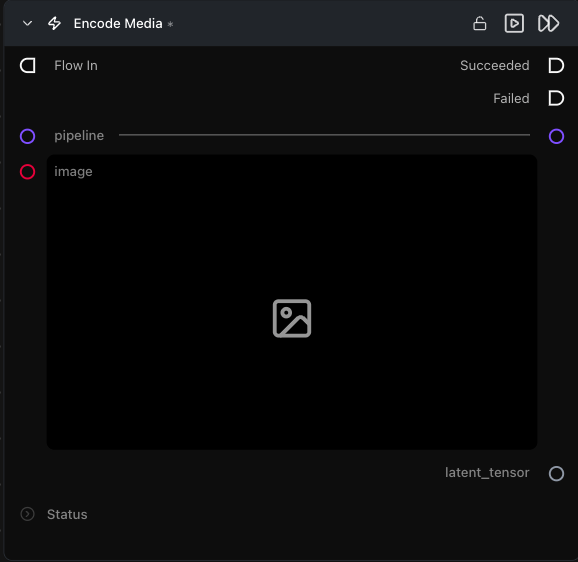

# Encode Media Latent

**Runs the pipeline's VAE encoder on an image or video, producing a latent you can feed into denoising for Image-to-Image / Video-to-Video flows.**

Category: `ModularDiffusion/Encode\Decode`

## TL;DR
- The input parameter is **dynamic**: `image` for image pipelines, `input_video` for video pipelines (LTX, LTX2, WAN). It swaps automatically when you connect a `pipeline`.
- Latents are normalized and unpacked — they're shape-compatible with [Create Noise Latents](create-noise-latents.md), so the latent math / composite nodes work on them directly.
- Pair with `add_noise=True` on a downstream Generate Media Latents for classic Image-to-Image. The amount of noise added is controlled by `start_step` on that node: `strength = 1 − (start_step / num_inference_steps)`. Examples with `num_inference_steps=20`:
  - `start_step=0` → full noise (strength 1.0) — original image is ignored, behaves like Text-to-Image.
  - `start_step=10` → half noise (strength 0.5) — balanced blend of original and generated.
  - `start_step=18` → very little noise (strength 0.1) — result stays very close to the original image.

## Typical workflow position
```text
Load Image → [Encode Media Latent] → Generate Media Latents → Decode Media Latent
```

## Node preview



## Inputs

| Name | Type | Required | Notes |
| --- | --- | --- | --- |
| `pipeline` | `Pipeline Config` | Yes | Determines whether the input slot is `image` or `input_video`. |
| `image` | `ImageArtifact` / `ImageUrlArtifact` | When pipeline is image-only | Source image. |
| `input_video` | `VideoArtifact` / `VideoUrlArtifact` | When pipeline is video | Source video. |

## Outputs

| Name | Type | Notes |
| --- | --- | --- |
| `latent_tensor` | `LatentArtifact` | Encoded latent in the pipeline's canonical latent space. |

## Tips & pitfalls

- **The input slot changes depending on the connected pipeline.** Image pipelines (Flux, SD3, etc.) show an `image` input; video pipelines (LTX, LTX2, WAN) show `input_video` instead. If you switch pipeline types after wiring something up, the old connection is dropped and you need to reconnect.
- **Input resolution drives latent shape.** The latent's spatial dimensions are `input / vae_scale_factor`. If a downstream node insists on a specific shape, resize the input first.
- **Don't use this for fresh text-to-image / text-to-video.** Use [Create Noise Latents](create-noise-latents.md) — encoding an image gives you an Image-to-Image starting point, not noise.

## See also

- [Encode Masked Media Latent](encode_masked_media_latent.md) — inpaint variant.
- [Decode Media Latent](decode_media_latent.md) — inverse operation.
- Workflow template: `workflows/templates/Modular_i2i_workflow.py`.
