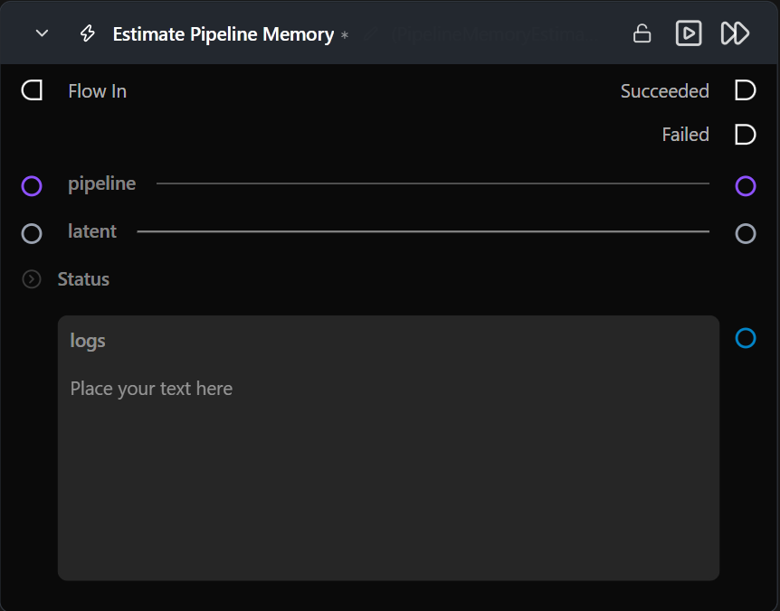

# Estimate Pipeline Memory

**Estimates per-component GPU memory usage for a diffusion pipeline, built or not, without running it.**

Category: `ModularDiffusion/Pipeline`

## TL;DR
- Breaks down memory into weights and activations for each resident component (text encoders, transformer/UNet, VAE).
- Uses the latent's shape to size the denoiser's and VAE's activation-memory estimate, so it must be wired to a real latent.
- Works whether or not the pipeline has been built yet: if it's already loaded (e.g. after a Generate Media Latents node has run) the estimate is exact; otherwise it's derived from the pipeline's config alone. This node never triggers a pipeline build itself.
- Estimates are analytical, biased to overestimate, and target ~20% relative accuracy — not measured, exact byte counts.

## Typical workflow position

```text
Pipeline Builder → Generate Media Latents → [Estimate Pipeline Memory]
```

## Node preview



## Inputs

| Name | Type | Required | Notes |
| --- | --- | --- | --- |
| `pipeline` | `Pipeline Config` | Yes | Connect from Pipeline Builder. Does not need to be built/resident yet — see Provider / model behavior. |
| `latent` | `LatentArtifact` | Yes | Determines the token count / resolution used in the activation-memory estimate. |

## Outputs

| Name | Type | Notes |
| --- | --- | --- |
| `logs` | `str` | Multiline per-component breakdown (weights, activations, total) plus the estimated peak. |
| `was_successful` | `bool` | `True` when the estimate completed without exception. |
| `result_details` | `str` | Summary line with the estimated peak and component count. |

## Provider / model behavior

Denoiser activation memory is estimated using one of three architecture families: UNet-SDPA (SDXL), Image-DiT-SDPA (Flux, Flux2, SD3, Qwen, Z-Image, ...), or Video-DiT-joint-SDPA (LTX, LTX2, WAN, HunyuanVideo 1.5, MiniMax-H3). A pipeline class without a registered family, or a component whose config can't be read (e.g. a heavily fused/custom checkpoint), falls back to a weight-only estimate with a warning in the logs rather than failing.

**ControlNet (Flux, SD3, SDXL, Qwen, Z-Image).** When the connected pipeline is wrapped by a [ControlNet Pipeline](controlnet_pipeline.md) node, each stacked ControlNet appears as its own `controlnet_0`, `controlnet_1`, … component — weight bytes scale ~linearly with stack size, since each is an independent weight set regardless of the multi-ControlNet wrapper class used under the hood. Weight bytes are read from each ControlNet's own config (its own repo, not the base pipeline's), so a ControlNet's shape is never assumed to match the base denoiser's. Activation bytes reuse the base architecture family's per-token formula against the ControlNet's own (usually smaller) layer count — an approximation, always flagged `[ESTIMATED: ...]`. On SDXL specifically, this reuses the full UNet-SDPA level formula against the real ControlNetModel's down-only architecture (no up-blocks), which overestimates on purpose per this node's bias-toward-overestimate stance. Before the pipeline is built, each ControlNet's config must already be in the warm HuggingFace cache — otherwise that ControlNet's entry falls back to weights-only with a warning.

This node estimates from whichever of two states the pipeline is actually in:

| Pipeline state | Basis | Weight memory | Offload topology |
| --- | --- | --- | --- |
| Already built and resident in the model cache | Exact | Read directly off the resident tensors — reflects the pipeline's actual loaded dtype and quantization. | Detected from the pipeline's live CPU-offload hooks. |
| Not built yet | Config-only | Derived from each component's cached config, built on the meta device (no download, no weight data read) at the dtype/quantization the pipeline *would* load with. | Taken from the requested `cpu_offload_strategy`, **unless** `memory_optimization_strategy` is `Automatic` (see below). |

VAE activation memory reflects whether `vae_tiling`/`vae_slicing` are configured, in both states.

**`memory_optimization_strategy` = `Automatic`, pipeline not yet built:** the real Automatic cascade depends on free VRAM at build time, which this node has no way to predict before loading — it does not simulate the cascade. Instead it reports a conservative upper bound (no offload assumed) and adds a warning to the logs recommending `Manual` for an exact pre-load number. Once the pipeline is actually built, re-running this node picks up whatever topology Automatic really landed on, exactly.

## API reference

This node is a thin wrapper — the estimate itself is a plain importable function, callable from any other node or script without going through the node at all.

```python
from modular_diffusion_nodes_library.memory_estimation.pipeline_memory_estimator import (
    estimate_pipeline_memory_from_artifact,
)

estimate = estimate_pipeline_memory_from_artifact(pipeline_artifact, latent_artifact)
```

Note the import path: `estimate_pipeline_memory_from_artifact` is exported from the `pipeline_memory_estimator` submodule, not from `modular_diffusion_nodes_library.memory_estimation`'s top-level `__init__.py` (which only re-exports `estimate_pipeline_memory` and `estimate_component_memory`).

### `estimate_pipeline_memory_from_artifact(artifact, latent) -> PipelineMemoryEstimate`

| Parameter | Type | Notes |
| --- | --- | --- |
| `artifact` | `DiffusionPipelineArtifact` | Same object as this node's `pipeline` input. |
| `latent` | `LatentArtifact` | Same object as this node's `latent` input. |

`PipelineMemoryEstimate` fields:

| Field | Type | Notes |
| --- | --- | --- |
| `pipeline_name` | `str` | |
| `basis` | `str` | `"loaded"` or `"config_only"` — see Provider / model behavior above. |
| `offload_mode` | `str \| None` | `"model"`, `"sequential"`, or `None`. |
| `estimated_peak_bytes` | `int` | The number this node's `result_details` output surfaces. |
| `components` | `list[ComponentMemoryEstimate]` | One entry per weight-bearing component. |
| `warnings` | `list[str]` | Pipeline-level caveats, e.g. the `Automatic`-strategy warning. |
| `to_dict()` | `dict` | JSON-shaped, GB-rounded — the intended API output boundary. Fields on the dataclass itself stay byte-precise for further math. |

`ComponentMemoryEstimate` fields (each entry in `components`):

| Field | Type | Notes |
| --- | --- | --- |
| `component_name` | `str` | e.g. `"transformer"`, `"vae"`, `"text_encoder_2"`. |
| `role` | `str` | `"denoiser"`, `"vae"`, `"text_encoder"`, `"controlnet"`, or `"other"`. |
| `weight_bytes` | `int` | |
| `activation_bytes` | `int` | |
| `total_bytes` | `int` | `weight_bytes + activation_bytes`. |
| `is_estimated` | `bool` | `True` when a formula couldn't run and only weights are shown for this component. |
| `warning` | `str \| None` | Reason, present when `is_estimated` is `True`. |

### Lower-level functions

Also exported from `pipeline_memory_estimator`, for callers that don't want to go through an artifact:

| Function | Use when |
| --- | --- |
| `estimate_pipeline_memory(pipe, latent, optimization_kwargs, pipeline_name)` | You already hold a built `DiffusionPipeline` — skips the `model_cache` lookup entirely. |
| `estimate_component_memory(component, component_name, role, pipe, pipeline_name, latent, optimization_kwargs)` | You want just one component's number, not the whole pipeline. |

## Tips & pitfalls

- **A pre-load estimate is a lower bound on accuracy, not a guess.** Before the pipeline is built, the estimate comes from real config-derived shapes and dtypes (via a meta-device build), not a rough guess — but `Automatic`-strategy topology is unresolved until the pipeline is actually loaded.
- **Switching to `Automatic` hides Manual knobs, it doesn't reset them.** If `quantization_mode` or `transformer_layerwise_casting` were set while on `Manual`, they stay set (just hidden) after switching to `Automatic` — and a pre-load estimate will still apply them, even though the real `Automatic` build never quantizes weights at all (only `Manual` does). Re-check those values, or rebuild the pipeline, before trusting a pre-load `Automatic` estimate's weight numbers.
- **Watch for `[ESTIMATED: ...]` warnings in the logs.** These flag components whose activation memory could not be computed (unrecognized component, unregistered pipeline family, or an unreadable transformer/VAE config) — only weight memory is shown for those.
- **Treat the number as a guide, not a guarantee.** Estimates are analytical (no GPU profiling) and biased to overestimate; expect divergence from true peak usage.

## See also

- [Modular Diffusion Pipeline Builder](pipeline_builder.md)
- [Generate Media Latents](generate_media_latents.md)
- [Clear Pipeline Cache](clear_pipeline_cache.md)
