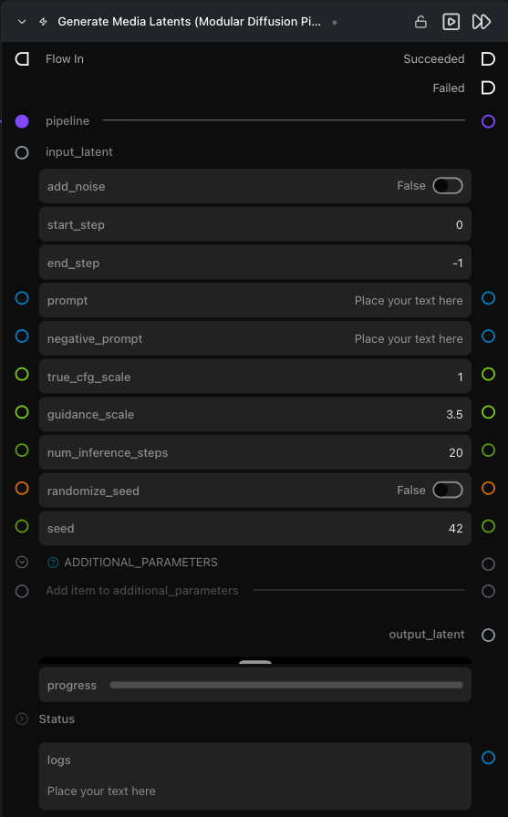

# Generate Media Latents (Modular Diffusion Pipeline)

**Runs the denoising loop. Takes a noise / encoded / partially-denoised latent in, returns a denoised latent out.**

Category: `ModularDiffusion/Processing`

## TL;DR
- The workhorse node. Connect a `pipeline` and an `input_latent`; configure the prompt and steps; run.
- All runtime parameters (prompt, guidance, dimensions, ControlNet inputs) are **dynamic** — they appear and adapt based on the connected pipeline.
- For **multi-stage / rediffusion** workflows, chain multiple Generate nodes and use `start_step` / `end_step` to slice the denoising schedule.
- Output is a latent — pass through [Decode Media Latent](decode_media_latent.md) to get an image / video.

## Typical workflow position
```text
Pipeline Builder → Create Noise Latents → [Generate Media Latents] → Decode Media Latent
```

## Node preview



## Inputs

| Name | Type | Required | Notes |
| --- | --- | --- | --- |
| `pipeline` | `Pipeline Config` | Yes | From [Pipeline Builder](pipeline_builder.md) or [ControlNet Pipeline](controlnet_pipeline.md). |
| `input_latent` | `LatentArtifact` or `InpaintMaskArtifact` | Yes | Starting latent. Use Noise (Text-to-Image / Text-to-Video), Encode (Image-to-Image, Video-to-Video), or a prior Generate output (multi-stage). |
| `controlnet_parameters` | `control_parameters` | Only if `pipeline` is a ControlNet pipeline | From the ControlNet Pipeline node's `control_parameters` output. |
| `additional_parameters` | list[dict] | No | Provider-specific conditioning extras. See [Media Gen Conditioning](media_gen_conditioning.md). |

## Outputs

| Name | Type | Notes |
| --- | --- | --- |
| `output_latent` | `LatentArtifact` | The denoised latent. |
| `preview_image` | `ImageUrlArtifact` | Live intermediate previews — only populated when **Settings → Modular Diffusion Library → Enable Image Preview Intermediates** is on. |
| `progress` | progress bar | Step counter. |
| `logs` | str | Per-step timing log. |

## Parameters

### Generation *(dynamic — provider-specific)*

The exact list depends on the connected pipeline. Common parameters:

| Name | Type | Notes |
| --- | --- | --- |
| `prompt` | str | Positive prompt. |
| `negative_prompt` | str | Negative prompt — appears for pipelines that support classifier-free guidance. |
| `guidance_scale` / `true_cfg_scale` | float | Classifier-free / true-CFG guidance strength. Naming varies per pipeline. |
| `num_inference_steps` | int (default `20`) | Length of the denoising schedule. |
| `seed` | int | Reproducibility. |

### Multi-stage / partial denoise

| Name | Type | Default | Notes |
| --- | --- | --- | --- |
| `add_noise` | bool | `False` | Re-noise the input before denoising (useful for rediffusion / Image-to-Image-style runs). |
| `start_step` | int | `0` | 0-based start index into the denoising schedule. |
| `end_step` | int | `-1` | 0-based end index; `-1` runs to the end. |

## Provider / model behavior

- **ControlNet:** when `pipeline` is a `ControlNetDiffusionPipelineArtifact`, the `controlnet_parameters` input is added automatically.
- **Inpainting:** when `input_latent` is an `InpaintMaskArtifact` (from [Encode Masked Media Latent](encode_masked_media_latent.md)), the node automatically routes through the inpaint pipeline class and uses the artifact's `strength`.

## Tips & pitfalls

- **Pipeline change resets connections you don't care about.** The node preserves connections to parameters whose names survive the change, but reorders the UI. Save your workflow before swapping providers.
- **Live previews slow inference.** Off by default. Toggle in **Settings → Modular Diffusion Library → Enable Image Preview Intermediates**.
- **`start_step` / `end_step` are sliced from the scheduler.** Combine two Generate nodes (e.g. `0–10` then `10–20`) for multi-stage refinement.
- **Cancellation works mid-step.** Hitting cancel sets the pipeline's `_interrupt` flag; the run stops after the current step.
- **Dimensions come from `input_latent`.** Generate has no width / height / num_frames fields — set those on the upstream [Create Noise Latents](create-noise-latents.md) (or whatever produces the starting latent).

## See also

- [Modular Diffusion Pipeline Builder](pipeline_builder.md)
- [Create Noise Latents](create-noise-latents.md) · [Encode Media Latent](encode_media_latent.md) · [Encode Masked Media Latent](encode_masked_media_latent.md) — common upstream nodes.
- [Decode Media Latent](decode_media_latent.md) — typical downstream node.
- Workflow templates: `workflows/templates/Text2Image.py`, `workflows/templates/MultistageText2Image.py`, `workflows/templates/Image2Image.py`.
