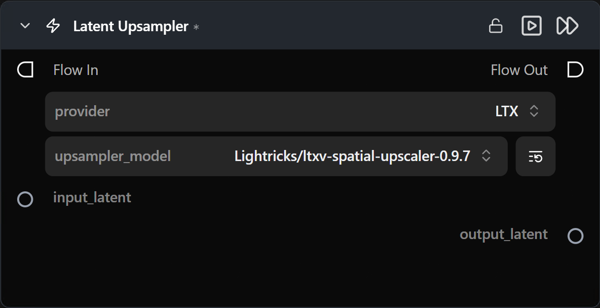

# Latent Upsampler

**Spatially upscales a latent tensor without leaving latent space — typically used between two Generate stages for a fast, high-resolution refinement pass.**

Category: `ModularDiffusion/Processing`

## TL;DR
- Upsamples in **latent space**, so you avoid a costly decode → upscale → re-encode round trip.
- `provider` picks the upsampler family.
- Use between two Generate Media Latents nodes: low-res pass → upsample → high-res refinement pass.

## Typical workflow position
```text
Generate Media Latents (low-res) → [Latent Upsampler] → Generate Media Latents (refine) → Decode
```

## Node preview



## Inputs

| Name | Type | Required | Notes |
| --- | --- | --- | --- |
| `input_latent` | `LatentArtifact` | Yes | Latent to upsample. Must be in the pipeline's canonical latent space (any Generate / Encode output qualifies). |

## Outputs

| Name | Type | Notes |
| --- | --- | --- |
| `output_latent` | `LatentArtifact` | Spatially-upscaled latent. |

## Parameters

| Name | Type | Notes |
| --- | --- | --- |
| `provider` | choice | Upsampler family (e.g. `LTX2`). Switching regenerates the model picker. |
| `upsampler_model` | HF repo picker | Hugging Face repo ID for the upsampler weights. |

## Tips & pitfalls

- **Latent-space upsamplers are family-specific.** An LTX2 upsampler will not produce sensible output for an SDXL latent. Match the upsampler family to the latent's pipeline.
- **You almost always want a refinement Generate after upsampling.** The upsampler increases resolution but doesn't denoise — pair it with a short follow-up Generate at low strength.

## See also

- [Generate Media Latents](generate_media_latents.md) — pair upstream and downstream.
- [Decode Media Latent](decode_media_latent.md) — final step.
