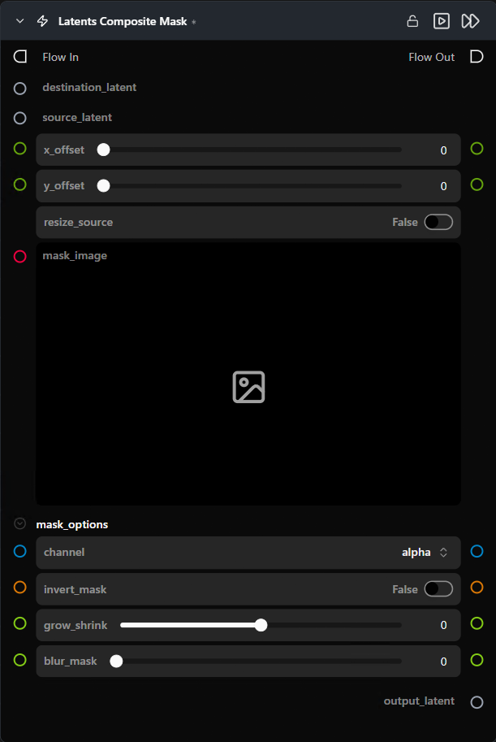

# Latents Composite Mask

**Pastes a source latent onto a destination latent at a given pixel offset, blended through an optional image mask.**

Category: `ModularDiffusion/Transform`

## TL;DR
- Drop a source latent into a destination latent at `(x_offset, y_offset)`. White mask pixels → source; black → destination.
- Offsets are **pixel-space**; the node converts to latent space internally (÷ 8).
- Enable `resize_source` to scale the source to the destination's spatial size before compositing.
- Mask is automatically resampled to match the source latent.

## Typical workflow position
```text
Generate Latents (dest) ──┐
Generate Latents (src) ───┼─→ [Latents Composite Mask] → Generate Media Latents
Paint Mask (mask) ────────┘
```

## Node preview



## Inputs

| Name | Type | Required | Notes |
| --- | --- | --- | --- |
| `destination_latent` | `LatentArtifact` | Yes | Base canvas. |
| `source_latent` | `LatentArtifact` | Yes | Latent to paste in. |
| `mask_image` | `ImageArtifact` / `ImageUrlArtifact` | No | Blend mask. If omitted, the source replaces the destination wholesale within its placement region. |

## Outputs

| Name | Type | Notes |
| --- | --- | --- |
| `output_latent` | `LatentArtifact` | Destination with source composited in. |

## Parameters

### Placement

| Name | Type | Default | Notes |
| --- | --- | --- | --- |
| `x_offset` | int (pixels, 0–2000) | `0` | Horizontal placement (divided by 8 internally). |
| `y_offset` | int (pixels, 0–2000) | `0` | Vertical placement. |
| `resize_source` | bool | `False` | Bilinearly resize source to match destination spatial size before compositing. |

### Mask options *(collapsed by default)*

| Name | Type | Default | Notes |
| --- | --- | --- | --- |
| `channel` | choice | `alpha` | Which channel of `mask_image` to use as blend weight. |
| `invert_mask` | bool | `False` | Swap source/destination regions. |
| `grow_shrink` | float (-100..100) | `0` | Dilate (+) or erode (-) the mask edge. |
| `blur_mask` | float (0..100) | `0` | Feather the mask edge. |

## Tips & pitfalls

- **Source outside the destination is silently dropped.** If `x_offset` + source width clips off-canvas, the off-canvas portion is discarded; the destination is returned unchanged if nothing intersects.
- **Pixel offsets, not latent offsets.** A 1024-px destination = 128 latent units. Offsets are in the bigger pixel space — the node divides by the VAE scale factor (8) internally.
- **Works for both 4D image latents and 5D video latents.** The mask is broadcast across the temporal dimension.

## See also

- [Create Empty Latents](empty_latents.md) — typical destination canvas.
- [Add Latents](add_latents.md) — for unmasked elementwise blending.
