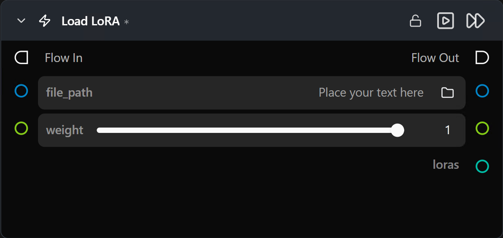

# Load LoRA

**Loads a LoRA file from local disk and exposes it as a `loras` output that the Pipeline Builder accepts.**

Category: `ModularDiffusion/Pipeline`

## TL;DR
- One LoRA per node. To stack LoRAs, drop multiple `Load LoRA` nodes and connect them all to the same Pipeline Builder.
- LoRAs are **fused** into the model weights when the pipeline is built — `weight` is baked in at that point, not applied at generation time. Changing any LoRA or its weight **rebuilds** the cached pipeline.
- Accepts `.safetensors`, `.sft`, `.pt`, `.bin`, `.json`, `.lora`.

## Typical workflow position
```text
[Load LoRA] ─┐
[Load LoRA] ─┼─→ Pipeline Builder → Generate Media Latents
[Load LoRA] ─┘
```

## Node preview



## Inputs

| Name | Type | Required | Notes |
| --- | --- | --- | --- |
| `file_path` | path | Yes | Absolute path to the LoRA file. |
| `weight` | float (0.0–1.0) | No | Influence of this LoRA, default `1.0`. |

## Outputs

| Name | Type | Notes |
| --- | --- | --- |
| `loras` | `loras` (dict) | `{path: weight}` — connect to the `loras` input on the Pipeline Builder. |
| `trigger_phrase` | str | Optional pass-through phrase to include in your prompt; hidden by default. |

## Tips & pitfalls

- **Hugging Face repo IDs are not supported here.** Download the file first; this node loads from disk only.
- **LoRA must match the base pipeline architecture** (Flux LoRA → Flux pipeline, etc.). Mismatches surface at pipeline-build time, not when the LoRA loads.
- **`weight` is baked in at fuse time.** Because LoRAs are fused into the model, you cannot change `weight` between generations without triggering a full pipeline rebuild.
- **Trigger phrases:** if your LoRA needs a trigger word, put it in your prompt manually — the `trigger_phrase` parameter is hidden by default and is currently passthrough metadata only.

## See also

- [Modular Diffusion Pipeline Builder](pipeline_builder.md) — required consumer.
- Workflow template: `workflows/templates/Modular_t2i_with_Loras_workflow.py`.
