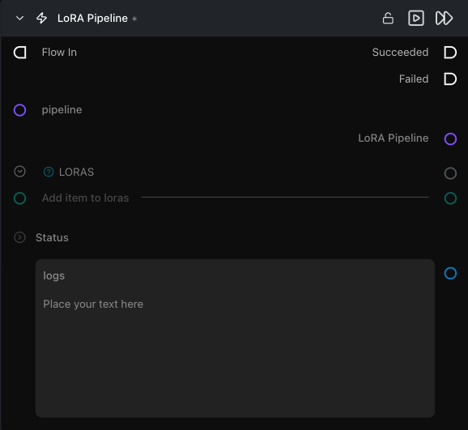

# LoRA Pipeline

**Layers non-fused LoRA adapters on top of an existing pipeline so the same cached model can power multiple branches simultaneously.**

Category: `ModularDiffusion/Pipeline`

## TL;DR
- Connect a Pipeline Builder output and one or more Load LoRA nodes here; wire the `lora_pipeline` output to Generate Media Latents instead of the Pipeline Builder directly.
- Adapters are activated per generation and released afterward — the base pipeline is **never permanently modified**, so a single cached model can drive multiple branches (one with LoRAs, one without) without rebuilding.
- Prefer this node over fusing LoRAs on the Pipeline Builder when swapping adapters between runs or using in-context (IC) LoRAs, distillation/acceleration LoRAs, or slider LoRAs.

## Typical workflow position
```text
Pipeline Builder ──→ [LoRA Pipeline] ←── Load LoRA
                          │
                          └──→ Generate Media Latents → Decode Media Latent
```

## Node preview



## Inputs

| Name | Type | Required | Notes |
| --- | --- | --- | --- |
| `pipeline` | `Pipeline Config` | Yes | Base diffusion pipeline. Connect from Pipeline Builder. The base pipeline is reused, not modified — wire it to other nodes simultaneously. |
| `loras` | `loras` | Yes | One or more LoRA payloads from Load LoRA nodes. Accepts a list; connect multiple Load LoRA outputs to stack adapters. |

## Outputs

| Name | Type | Notes |
| --- | --- | --- |
| `lora_pipeline` | `Pipeline Config` | Pipeline reference that activates the listed LoRAs around each generation call. Shares the cache entry of the input pipeline — wiring this to Generate Media Latents does not trigger a rebuild. |
| `logs` | str | Build log, including the pipeline configuration hash. |

## Tips & pitfalls

- **Activation LoRAs vs. fused LoRAs are not equivalent.** Fused LoRAs (baked via the Pipeline Builder `loras` input) are permanently merged into weights; activation LoRAs (this node) are applied transiently. Changing a fused LoRA evicts the entire pipeline cache. Changing an activation LoRA does not.
- **Connect at least one LoRA.** The node requires at least one entry in `loras` to activate — wire one or more [Load LoRA](load_lora.md) nodes before running.
- **The `lora_pipeline` output shares the cache with the input `pipeline`.** You can wire both to separate Generate Media Latents nodes (one with LoRAs, one without) without loading the model twice.
- **LoRA weights are applied per run.** Unlike fused LoRAs, changing `weight` on a Load LoRA node between runs does not rebuild the pipeline.

## See also

- [Load LoRA](load_lora.md) — provides the `loras` input.
- [Modular Diffusion Pipeline Builder](pipeline_builder.md) — provides the base `pipeline` input.
- [Generate Media Latents](generate_media_latents.md) — consumes the `lora_pipeline` output.
