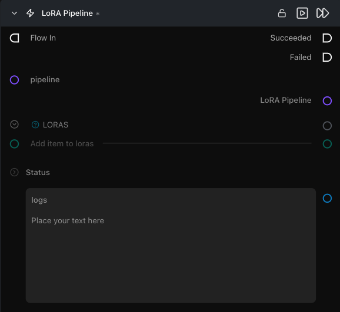

# Apply Runtime LoRA

**Layers non-fused LoRA adapters on top of an existing pipeline so the same cached model can power multiple branches simultaneously.**

Category: `Diffusion/Pipeline`

## TL;DR
- Connect the Build Pipeline node's output and at least one `loras` output from a Load LoRA node to this node. Then connect this node's `lora_pipeline` output to Generate Latent.
- Adapters are activated per generation and released afterward — the base pipeline is **never permanently modified**, so a single cached model can drive multiple branches (one with LoRAs, one without) without rebuilding.
- Use this node instead of connecting LoRAs to the Build Pipeline node when you need to swap adapters between runs or use in-context (IC), distillation/acceleration, or slider LoRAs.

## Typical workflow position
```text
Build Pipeline ────┐
                   ├─→ [Apply Runtime LoRA] → Generate Latent → Decode Media
Load LoRA ─────────┘
```

## Node preview



## Inputs

| Name | Type | Required | Notes |
| --- | --- | --- | --- |
| `pipeline` | `Pipeline Config` | Yes | Connect a pipeline from the Build Pipeline node. This node reuses it without modification, so the original pipeline remains available to other nodes. |
| `loras` | `loras` | Yes | One or more LoRA payloads from Load LoRA nodes. Accepts a list; connect multiple Load LoRA outputs to stack adapters. |

## Outputs

| Name | Type | Notes |
| --- | --- | --- |
| `lora_pipeline` | `Pipeline Config` | Pipeline reference that activates the listed LoRAs around each generation call. Shares the cache entry of the input pipeline — wiring this to Generate Latent does not trigger a rebuild. |
| `logs` | str | Build log, including the pipeline configuration hash. |

## Tips & pitfalls

- **Runtime LoRAs differ from fused LoRAs.** The Build Pipeline node permanently merges connected LoRAs into the model weights. The Apply Runtime LoRA node activates adapters only for each generation. Changing a fused LoRA evicts the pipeline cache; changing a runtime LoRA does not.
- **Connect at least one LoRA.** The node requires at least one entry in `loras` to activate — wire one or more [Load LoRA](load_lora.md) nodes before running.
- **The `lora_pipeline` output shares the cache with the input `pipeline`.** You can wire both to separate Generate Latent nodes (one with LoRAs, one without) without loading the model twice.
- **Memory estimates include runtime adapter weights.** When the output of an Apply Runtime LoRA node is connected to Estimate Pipeline Memory, each distinct connected adapter contributes its header-derived weight bytes to the transformer estimate. Multiple adapters are aggregated in that visible transformer row; the detailed adapter list is shown separately in human-readable units in the widget and source-only CLI.
- **LoRA weights are applied per run.** Unlike LoRAs fused into the model by the Build Pipeline node, runtime LoRA weights can change between runs without rebuilding the pipeline.

## See also

- [Load LoRA](load_lora.md) — provides the `loras` input.
- [Build Pipeline](pipeline_builder.md) — provides the base `pipeline` input.
- [Generate Latent](generate_media_latents.md) — consumes the `lora_pipeline` output.
