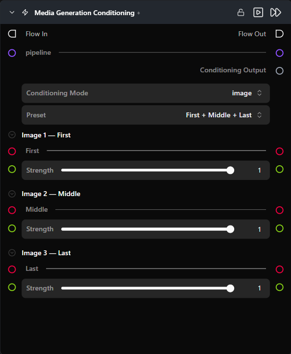

# Media Generation Conditioning

**Packages one or more conditioning images (or a video) with per-frame placement and strength, ready to connect into any pipeline that supports media-driven conditioning.**

Category: `ModularDiffusion/Conditioning`

## TL;DR
- Connect a pipeline to get preset layouts tailored to that model (e.g. first/last frame slots for WAN Image-to-Video).
- Without a pipeline, a flexible image-or-video layout is shown with a "Preset" dropdown; a number of images slider is shown in "Custom" preset mode.
- Connect the `conditioning` output to the `media_conditions` (LTX / LTX2 / WAN) or `reference_images` (Flux2 Klein) input on Generate Media Latents.

## Typical workflow position
```text
Pipeline Builder ──────────────────────────────────────────┐
                                                           ├─→ Generate Media Latents → Decode
Load Image (first) ──┐                                     │
Load Image (last) ───┴─→ [Media Generation Conditioning] ──┘
```

## Node preview



## Inputs

| Name | Type | Required | Notes |
| --- | --- | --- | --- |
| `pipeline` | `Pipeline Config` | No | When connected, swaps the conditioning surface to the layout tailored for that pipeline. |
| `image_{i}` | `ImageUrlArtifact` | No | Conditioning image at slot `i`. Visible in image mode; the number of slots depends on user settings. |
| `video` | `VideoUrlArtifact` | No | Conditioning video. Visible in video mode only. |

## Outputs

| Name | Type | Notes |
| --- | --- | --- |
| `conditioning` | `media_gen_conditioning` | Typed payload of images/video + per-entry frame position + strength. Connect to the matching input on Generate Media Latents. |

## Parameters

### Mode and preset selection

| Name | Type | Default | Notes |
| --- | --- | --- | --- |
| `mode` | `image` \| `video` | `image` | Hidden when the connected pipeline supports only one mode. Switching regenerates all input slots. |
| `image_preset` | choice | `Custom` | Dropdown selecting a named arrangement of image slots. Options and default depend on the connected pipeline (see Provider / model behavior). Hidden in video mode. |
| `num_images` | int slider | `0` | Number of image slots. Visible only when `image_preset = Custom`. Range is 0–8 by default; may be narrowed by the pipeline config. |

### Per-image slot *(one set per slot, in image mode)*

| Name | Type | Default | Notes |
| --- | --- | --- | --- |
| `image_{i}_frame_index` | int | `0` | Output-frame position for this image. Hidden in preset mode (position is locked) and for pipelines where it is not applicable (e.g. Flux2 Klein). |
| `image_{i}_strength` | float (0.0–1.0) | `1.0` | Per-image conditioning weight. Hidden for pipelines that do not use per-image strength. |

### Video mode

| Name | Type | Default | Notes |
| --- | --- | --- | --- |
| `frame_index` | int | `0` | Output-frame index where the conditioning video starts. |
| `video_strength` | float (0.0–1.0) | `1.0` | Conditioning weight for the video. |

## Provider / model behavior

### No pipeline connected (default)

Both image and video modes are available. `Preset` choices: **Custom** (default), First + Middle + Last, First + Last, First frame. In Custom mode, `num_images` (0–8), `frame_index`, and `strength` are all adjustable. video mode, a single `video` input with `frame_index` and `video_strength` is shown

### WAN Image-to-Video

Image mode only. `Preset` choices: **First + Last** (default), First frame.

### LTX / LTX2

Same as "No pipeline connected" but in image mode, **First + Middle + Last** is default.

### Flux2 Klein

Image mode only. Flexible image slots (1–8). The `reference_images` input on Generate Media Latents is active only when an inpaint mask is also connected.

## Tips & pitfalls

- **Connect the pipeline first.** The layout swaps immediately on connection, replacing slots with the correct preset arrangement for that model.
- **Named presets lock frame positions.** When you select a named preset, each slot's output position is fixed by the preset's definition — you cannot override it. For example, with "First + Last", slot 0 is pinned to frame 0 and slot 1 is pinned to the final frame; the `frame_index` control is hidden because there is nothing to adjust. Switch to **Custom** preset if you need to place an image at a specific frame.
- **`frame_index` controls *where in the output video* the conditioning image appears**. `0` places the image at the very first frame of the generated video; -1 set it to the last frame number to anchor it at the end.

## See also

- [Generate Media Latents](generate_media_latents.md) · [Modular Diffusion Pipeline Builder](pipeline_builder.md)
