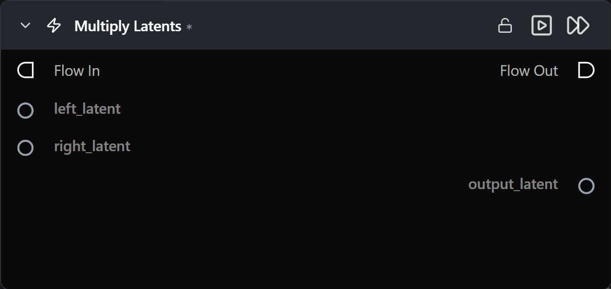

# Multiply Latents

**Elementwise product of two latent tensors.**

Category: `ModularDiffusion/Transform`

## TL;DR
- `output = left_latent * right_latent` elementwise.
- Most useful for **scalar-like scaling** (one input has a uniform value across the tensor) or for masking via a 0/1 latent.
- For masked compositing of two different latents, prefer [Latents Composite Mask](latents_composite_mask.md) — it's purpose-built and handles the mask resampling for you.

## Typical workflow position
```text
Latent A ─┐
          ├─→ [Multiply Latents] → Add Latents / Generate
Latent B ─┘
```

## Node preview



## Inputs

| Name | Type | Required | Notes |
| --- | --- | --- | --- |
| `left_latent` | `LatentArtifact` | Yes | |
| `right_latent` | `LatentArtifact` | Yes | Must match `left_latent` shape. |

## Outputs

| Name | Type | Notes |
| --- | --- | --- |
| `output_latent` | `LatentArtifact` | `left * right`. |

## Tips & pitfalls

- **This is not matrix multiplication.** It's elementwise.
- **Multiplying two arbitrary latents** rarely produces sensible imagery — the most reliable use is scaling one latent by a near-constant tensor.

## See also

- [Add Latents](add_latents.md) · [Subtract Latents](subtract_latents.md) · [Latents Composite Mask](latents_composite_mask.md)
