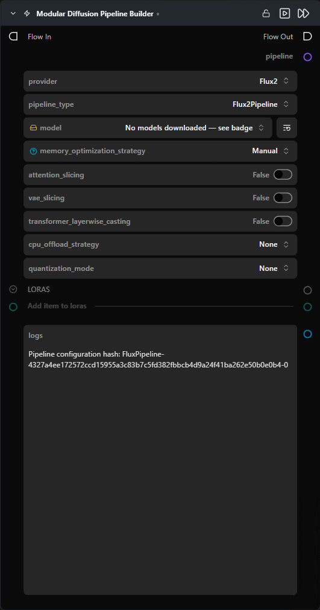

# Modular Diffusion Pipeline Builder

**Loads and caches a 🧨 Diffusers pipeline once, so every other node in the flow can reuse it.**

Category: `ModularDiffusion/Pipeline`

## TL;DR
- **Build once, generate many.** Place this node first; connect its `pipeline` output to every other Modular Diffusion node that needs weights (Generate, VAE Encode/Decode, Noise, etc.).
- **Pick `provider` first.** All other parameters (model repo, runtime knobs) regenerate based on this choice.
- **The pipeline is cached** by a hash of its config. Changing a load-time parameter (model repo, quantization, LoRAs) rebuilds and re-caches; runtime parameters (prompt, steps) do **not** trigger a rebuild.
- Output type: `Pipeline Config`.

## Typical workflow position
```text
[Pipeline Builder] → Create Noise Latents → Generate Media Latents → Decode Media Latent
```

## Node preview



## Inputs

| Name | Type | Required | Notes |
| --- | --- | --- | --- |
| `loras` | `loras` | No | Connect one or more [Load LoRA](load_lora.md) nodes. Stacked in connection order. |

## Outputs

| Name | Type | Notes |
| --- | --- | --- |
| `pipeline` | `Pipeline Config` | Cached pipeline artifact. Feed into every node that takes a `pipeline` input. |
| `logs` | `str` | Build log, including the resolved config hash. |

## Parameters

### Pipeline selection *(dynamic — these regenerate when `provider` changes)*

| Name | Type | Notes |
| --- | --- | --- |
| `provider` | choice | `Flux`, `Flux2`, `Stable Diffusion`, `Qwen`, `Z-Image`, `LTX`, `LTX2`, `WAN`. Changing this swaps every parameter below. |
| `pipeline_type` | choice | Per-provider pipeline class (e.g. `FluxPipeline`, `WanImageToVideoPipeline`). Determines what the pipeline can do. |
| `<model repo>` | HF repo picker | Hugging Face repo ID. Diffusers-format only — single-file `.safetensors` checkpoints are not loaded directly. |

### Memory optimization

| Name | Type | Default | Notes |
| --- | --- | --- | --- |
| `memory_optimization_strategy` | choice | `Manual` | `Automatic` hides the per-knob toggles below and uses sensible defaults per model. |
| `attention_slicing` | bool | `False` | Cheap memory win, small speed hit. |
| `vae_slicing` | bool | `False` | Decodes the latent in batches of 1; useful for large batch sizes. |
| `transformer_layerwise_casting` | bool | `False` | Keeps the transformer in a lower precision and upcasts per layer during compute. |
| `cpu_offload_strategy` | choice | `None` | `Model` (whole submodules) or `Sequential` (per-layer) — moves idle weights to CPU to free VRAM, trades inference speed. |
| `quantization_mode` | choice | `None` | `fp8` / `int8` / `int4` (via `optimum-quanto` / `bitsandbytes`). Shrinks transformer weights at the cost of some quality. |

Enable only what you need — each option trades speed for memory.

## Tips & pitfalls

- **Cache invalidation is hash-based.** If `pipeline` mysteriously rebuilds every run, check `logs` — a non-deterministic value in a load-time parameter (e.g. a random seed bleeding in) is hashing differently each run.
- **Pipeline missing from cache after restart.** The cache lives in process memory only; the node re-resolves automatically on the next run.
- **VRAM crash on load.** Drop quantization to `int8` or `int4`, switch `cpu_offload_strategy` to `Sequential`, or enable `vae_slicing`. Don't enable everything at once.
- **LoRAs not applying.** Confirm the LoRA file format is compatible with the chosen pipeline type, and that the LoRA node is connected to `loras` (not to a runtime input).
- **Provider switch wipes parameter values.** Provider is a destructive choice — input connections are preserved where the parameter name matches, but values reset.

## See also

- [Configure ControlNet](configure_controlnet.md) · [ControlNet Pipeline](controlnet_pipeline.md) — add ControlNet to a built pipeline.
- [Load LoRA](load_lora.md) — attach LoRAs to this builder.
- [Generate Media Latents](generate_media_latents.md) — the most common consumer of the `pipeline` output.
