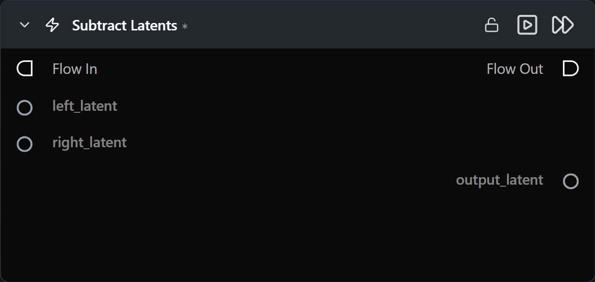

# Subtract Latents

**Elementwise difference of two latent tensors.**

Category: `ModularDiffusion/Transform`

## TL;DR
- `output = left_latent - right_latent` elementwise.
- Both inputs must share the same shape and latent space (i.e. come from the same pipeline type).
- Common uses: isolating noise (denoised − noisy), latent-space ablation experiments.

## Typical workflow position
```text
Latent A ─┐
          ├─→ [Subtract Latents] → Latent Math / Generate
Latent B ─┘
```

## Node preview



## Inputs

| Name | Type | Required | Notes |
| --- | --- | --- | --- |
| `left_latent` | `LatentArtifact` | Yes | Minuend. |
| `right_latent` | `LatentArtifact` | Yes | Subtrahend. Must match `left_latent` shape. |

## Outputs

| Name | Type | Notes |
| --- | --- | --- |
| `output_latent` | `LatentArtifact` | `left − right`. |

## Tips & pitfalls

- **Order matters** — subtraction is not commutative; `a − b` ≠ `b − a`.
- **Both inputs must have the same shape.** Resize or upsample one to match before subtracting.

## See also

- [Add Latents](add_latents.md) · [Multiply Latents](multiply_latents.md)
